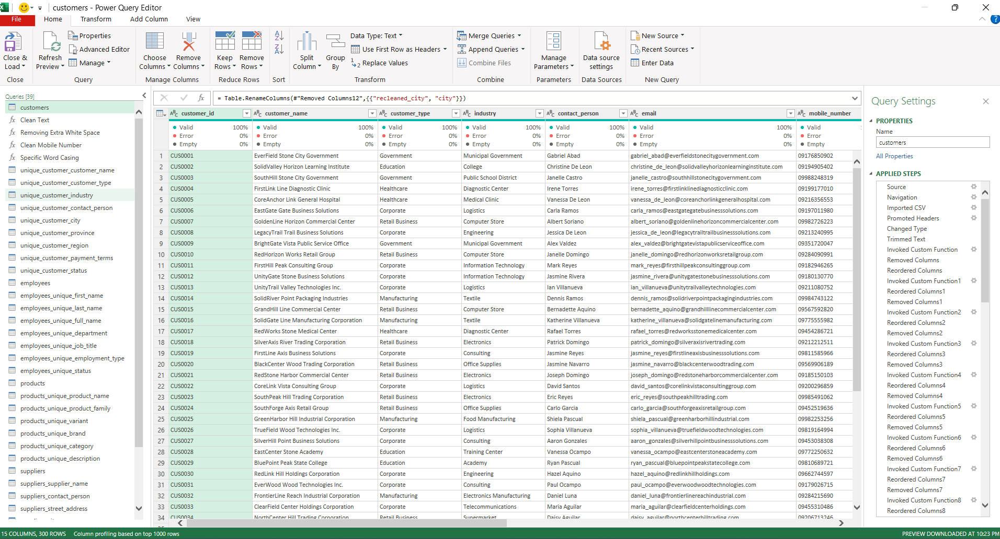
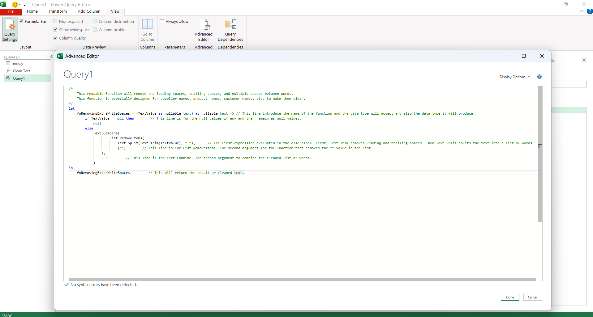
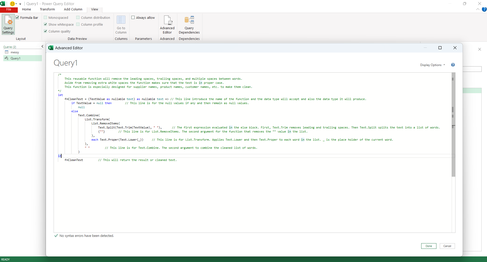
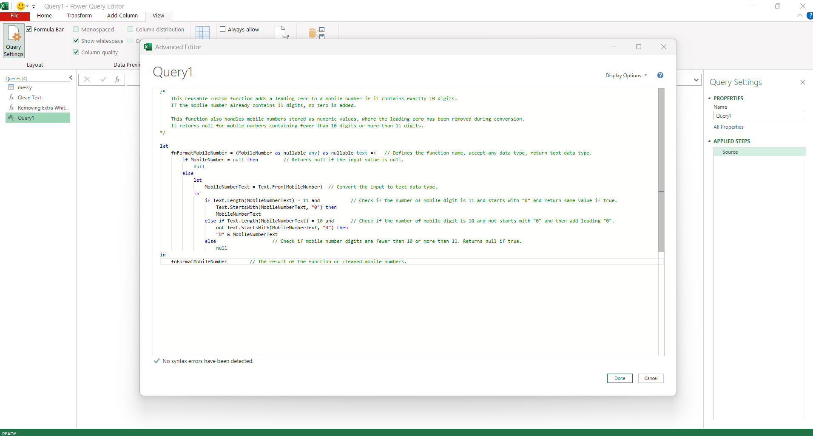
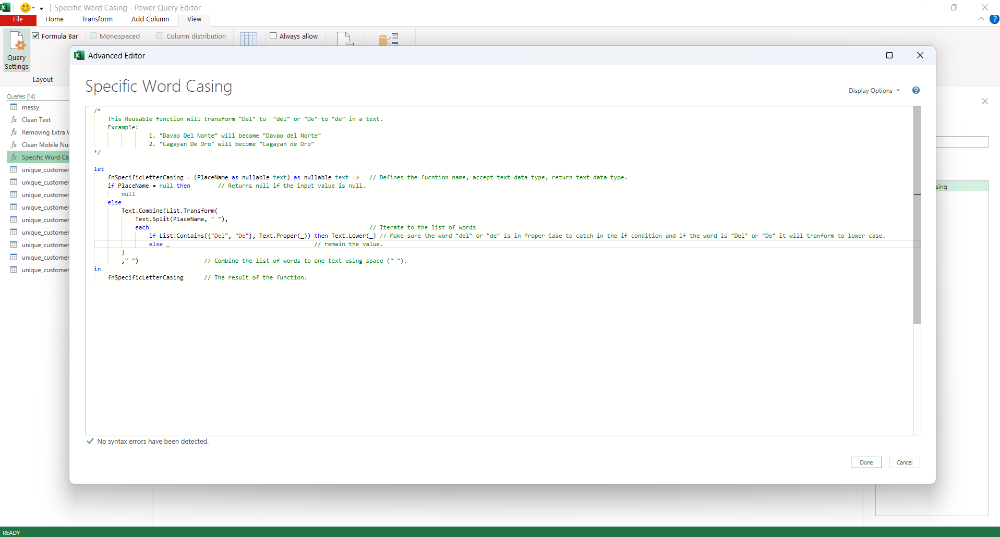
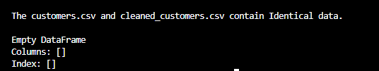

# Warehouse Analytics Portfolio

**End-to-End Data Analytics Project using Python, PostgreSQL, Excel, and Power BI**

---

## Project Overview

This project simulates the data environment of a warehouse distribution company by generating a fully relational Enterprise Resource Planning (ERP) dataset and transforming it into business-ready analytics.

The objective is to demonstrate the complete workflow of a Data Analyst—from designing a relational database, generating realistic transactional data, validating data quality, and preparing datasets for reporting, to building dashboards that support business decision-making.

Unlike small sample datasets commonly used for practice, this project produces a large-scale synthetic dataset containing:

- 7 relational tables
- 18 suppliers
- 50 products
- 300 customers
- 30 employees
- 500,000 sales orders
- More than 1 million order detail records
- Inventory records for every product
- 3 warehouses
- Timeline: January 2024 - July 2026

All datasets are generated using Python and validated through business rules before being exported as CSV files. The resulting data can be analyzed using SQL, Excel, and Power BI in the same manner as operational data from a real warehouse distribution business.

The project is intended to showcase practical Data Analytics skills expected in entry-level Data Analyst roles, including data modeling, data validation, business metric calculation, and dashboard development.

---

## Business Scenario

LOTS Corp. is a fictional warehouse distribution company that supplies technology products and office equipment to businesses, educational institutions, healthcare organizations, government agencies, and retail customers across the Philippines.

The company purchases products from multiple suppliers, stores inventory across several warehouses, and processes customer orders through a dedicated sales team.

Management requires accurate and reliable reporting to answer questions such as:

- Which products generate the highest sales?
- Which customers contribute the most sales?
- Which warehouses are approaching stock shortages?
- Which sales representatives manage the largest customer portfolios?
- Which product categories are growing over time?
- How much profit is generated after discounts?
- Which products require replenishment based on current inventory levels?

To support these business decisions, an end-to-end analytics solution was developed using a realistic synthetic ERP dataset.

---

## Project Objectives

The primary objectives of this project are to:

- Design a realistic relational warehouse dataset
- Generate large-scale transactional data using Python
- Apply business validation rules to ensure data integrity
- Build datasets suitable for SQL analysis
- Prepare clean datasets for Excel and Power BI reporting
- Create meaningful KPIs and business dashboards
- Demonstrate practical Data Analytics skills through an end-to-end project

---

## Project Highlights

- Fully relational ERP-style database
- 1.58 million+ synthetic ERP records generated across 7 relational tables
- Business-rule validation for generated datasets
- Realistic warehouse distribution scenario
- Sales, inventory, customer, supplier, and employee analytics
- SQL-ready and Power BI-ready datasets
- End-to-end workflow covering data generation, cleaning, validation, database analysis, and business intelligence reporting

---

## Dataset Overview

This project simulates the master and transactional data commonly found in a warehouse distribution ERP system.

The synthetic dataset was generated entirely using Python and follows realistic business rules to create relationships between customers, employees, products, suppliers, orders, order details, and inventory.

The completed dataset contains more than **1.58 million records** across **7 relational tables**, making it suitable for practicing SQL, Excel, Power BI, dashboard development, KPI reporting, and business analytics.

| Table | Description | Approximate Rows |
|--------|-------------|-----------------:|
| suppliers | Supplier master data | 18 |
| products | Product catalog and pricing | 50 |
| customers | Customer master data | 300 |
| employees | Employee master data | 30 |
| orders | Customer order transactions | 500,000 |
| order_details | Individual products purchased within each order | 1,080,643 |
| inventory | Current inventory snapshot for each product | 50 |

### Dataset Timeline

January 2024 – July 2026

### Business Domain

Warehouse Distribution / ERP / Inventory Management

### Relationship Overview

The dataset follows a relational ERP design.

```text
Suppliers
     │
     ▼
 Products
     │
     ▼
 Inventory

Customers ─────────────┐
                       │
Employees ─────────────┤
                       ▼
                    Orders
                       │
                       ▼
                Order Details
                       │
                       ▼
                    Products
```

## Business Rules

The dataset was generated using business rules designed to resemble a real warehouse distribution ERP system rather than purely random data.

---

## Documentation

Additional project documentation is available below:

- [Data Dictionary](docs/DATA_DICTIONARY.md)
- [Excel Data Cleaning](excel/README.md)
- [SQL Analysis](sql/README.md)
- [Power BI Documentation](powerbi/README.md)
- [Dashboard Specification](docs/DASHBOARD_SPECIFICATION.md)

---

## Data Quality Issue Injection

To demonstrate practical data cleaning skills, this project includes a data quality injection stage that intentionally introduces realistic data quality issues into selected datasets.

The validated datasets stored in `data/raw/` remain unchanged and serve as the reference source of truth. A separate Python utility (`inject_data_quality_issues.py`) generates modified copies in `data/messy/`, allowing the entire cleaning workflow to be performed without altering the original data.

### Purpose

The data quality injection process was created to simulate common data quality problems encountered in business environments. This provides a realistic dataset for demonstrating Power Query data cleaning techniques while preserving a validated version for comparison and verification.

### Datasets Included

Data quality issues are intentionally injected into the following datasets:

- [suppliers.csv](data/messy/suppliers.csv)
- [customers.csv](data/messy/customers.csv)
- [products.csv](data/messy/products.csv)
- [employees.csv](data/messy/employees.csv)

The remaining datasets (`orders.csv`, `order_details.csv`, and `inventory.csv`) are intentionally kept unchanged because they primarily demonstrate relational modeling, SQL analysis, and reporting rather than text data cleaning.

### Injected Data Quality Issues

Depending on the column type, the injector may introduce realistic issues such as:

- Leading spaces
- Trailing spaces
- Double spaces
- Uppercase text
- Lowercase text
- Random letter casing (non-email fields only)
- Typographical errors

Email columns follow a separate set of rules to preserve realistic email formats while still introducing common formatting inconsistencies.

### Validation Workflow

The project follows the workflow below:

1. Generate and validate the original datasets.
2. Create intentionally messy copies of selected datasets.
3. Clean the messy datasets using Power Query.
4. Compare the cleaned datasets against the validated originals.
5. Verify that the cleaning process successfully restores the original data before importing it into PostgreSQL for analysis and dashboard development.

This approach demonstrates not only data cleaning techniques but also the validation process used to confirm that the cleaned data matches the original validated dataset.

---

## Data Cleaning (Power Query)

After generating intentionally messy datasets, the next stage of the project focuses on restoring the data to its validated state using Microsoft Excel Power Query.

### Objective

The objective of this stage is to demonstrate practical data cleaning techniques commonly performed by Data Analysts before loading data into a database or reporting tool.

### Cleaning Tasks Performed

The following data quality issues were identified and corrected using Power Query:

- Removed leading and trailing spaces
- Removed extra internal spaces
- Standardized text casing
- Corrected inconsistent capitalization
- Corrected typographical errors
- Standardized text values where necessary

The following datasets were cleaned:

- [cleaned_customers.csv](data/cleaned/cleaned_customers.csv)
- [cleaned_employees.csv](data/cleaned/cleaned_employees.csv)
- [cleaned_products.csv](data/cleaned/cleaned_products.csv)
- [cleaned_suppliers.csv](data/cleaned/cleaned_suppliers.csv)

### Validation Process

After completing the cleaning process, the cleaned datasets were exported from Power Query and validated against the original validated datasets stored in [data/raw/](data/raw/).

Validation was performed using Python with the pandas `DataFrame.equals()` method to verify that the cleaned datasets exactly matched the original validated datasets.

Example:

```python
import pandas as pd

original_customer_df = pd.read_csv("customers.csv")
cleaned_customer_df = pd.read_csv("cleaned_customers.csv")

if original_customer_df.equals(cleaned_customer_df):
    print("The customers.csv and cleaned_customers.csv contain Identical data.")
else:
    print("The customers.csv and cleaned_customers.csv are different.")
```

Console output:

```text
The customers.csv and cleaned_customers.csv contain Identical data.
```

To see the full code: [python/validating_cleaning_data.py](python/validating_cleaning_data.py)

### Validation Results

All cleaned datasets successfully matched their corresponding validated datasets.

This confirms that:

- All intentionally injected data quality issues were successfully removed.
- No valid records were unintentionally modified.
- The Power Query cleaning process accurately restored the original validated data.

### Files

| File | Purpose |
|---|---|
| [inject_data_quality_issues.py](python/inject_data_quality_issues.py) | Generates intentionally messy datasets |
| [data_cleaning_version2.xlsx](excel/data_cleaning_version2.xlsx) | Power Query workbook used to clean the datasets |
| [data/raw/](data/raw/) | Original validated datasets |
| [data/messy/](data/messy/) | Datasets with injected quality issues |
| [data/cleaned/](data/cleaned/) | Cleaned datasets exported from Power Query |

### Power Query Editor



#### Data Cleaning Highlights

**Creating Reusable Custom Functions**

The following custom functions allow the same transformation logic to be applied across multiple columns. Instead of creating the same custom column repeatedly, the function can be invoked whenever the same logic is needed. This reduces duplicate code, improves maintainability, and ensures consistent data transformation throughout the Power Query data cleaning process.

1. **fnRemovingExtraWhiteSpaces**



2. **fnCleanText**



3. **fnFormatMobileNumber**



4. **fnSpecificLetterCasing**



To see the complete Power Query workflow, see [Data Cleaning using Power Query](excel/README.md#data-cleaning-using-power-query).

### Validation File

- [validating_cleaning_data.py](python/validating_cleaning_data.py)

### Validation Result



---

### Customer Activity

Customers are classified into three activity levels:

- **High** – Frequent purchasing customers
- **Medium** – Regular purchasing customers
- **Low** – Occasional purchasing customers

Customer activity determines the number of orders generated throughout the dataset.

---

### Sales Representatives

Each active customer is assigned to a dedicated Sales Representative.

All orders created by a customer are handled by their assigned account manager.

---

### Order Generation

Orders are generated between **January 2024** and **July 2026**.

Each order includes:

- Customer
- Sales Representative
- Order Status
- Payment Status
- Order Source
- Created and Updated timestamps

Order dates are distributed throughout the dataset timeline to simulate continuous business activity.

---

### Order Details

Each order contains between **1 and 4 unique products**.

Each order detail includes:

- Quantity
- Unit Cost
- Unit Selling Price
- Discount Percentage
- Line Total
- Line Cost
- Line Profit

Financial values are calculated using business formulas rather than random values.

---

### Inventory

Inventory is generated after all sales transactions are completed.

Current stock levels are based on:

- Historical product sales
- Sales velocity
- Inventory coverage period
- Reserved stock percentage

Inventory status is automatically classified as:

- In Stock
- Out of Stock

---

### Warehouse Assignment

Each product belongs to a warehouse based on its product category.

This ensures inventory records remain consistent and reflects a simplified warehouse distribution model.

---

### Data Integrity

The dataset generator applies relational integrity checks and business-rule validation across the generated tables.

Examples include:

- Unique primary keys
- Valid foreign key references
- One inventory record per product
- Timestamp validation
- Inventory business-rule validation
- Referential integrity between transactional and master tables

Financial values are also validated during dataset generation. However, a rounding discrepancy was encountered between Python-generated financial values and PostgreSQL's recalculation behavior for some `order_details` values. The related database financial `CHECK` constraints were removed so the portfolio could proceed without regenerating the full dataset. The issue is documented as a future improvement.

## Technology Stack

This project demonstrates an end-to-end Data Analytics workflow using industry-standard tools commonly required for Data Analyst roles.

| Technology | Purpose |
|---|---|
| **Python** | Generate the synthetic ERP dataset and implement business rules |
| **Pandas** | Data manipulation, validation, and CSV generation |
| **NumPy** | Numerical operations and calculations |
| **Faker** | Generate realistic customer, supplier, and employee information |
| **psycopg2** | Connect Python to PostgreSQL and load data into the database |
| **PostgreSQL** | Store and query the relational database |
| **pgAdmin** | Database administration and SQL development |
| **SQL** | Data extraction, aggregation, and business analysis |
| **Microsoft Excel** | Spreadsheet-based data cleaning and analysis |
| **Power Query** | Data transformation and cleaning |
| **Power BI** | Interactive dashboards and business intelligence reporting |
| **DAX** | Analytical measures and calculations |
| **Git** | Version control |
| **GitHub** | Project documentation and portfolio hosting |

---

### Skills Demonstrated

This project demonstrates practical experience in:

- [Data Modeling](powerbi/README.md#data-model)
- [Relational Database Design](sql/README.md)
- [Data Generation](python/)
- [Data Validation](sql/README.md)
- [Data Cleaning](excel/README.md#data-cleaning-using-power-query)
- [SQL Querying](sql/README.md)
- [Business Analytics](sql/README.md)
- [KPI Development](powerbi/README.md#dax-measures)
- [Inventory Analytics](powerbi/README.md#3-products--inventory-analysis)
- [Sales Analytics](powerbi/README.md#2-sales-analysis)
- [Dashboard Development](powerbi/README.md#report-structure)
- [Data Visualization](powerbi/README.md#analytical-capabilities-demonstrated)
- Business Reporting

---

## Power BI Dashboards & Business Questions

The cleaned and validated data was modeled in Power BI to create seven interactive dashboards focused on sales, profitability, inventory, customers, suppliers, and employee performance.

### Dashboard Pages

| Dashboard | Purpose |
|---|---|
| **Executive Dashboard** | Monitor overall business performance and key KPIs |
| **Sales Analysis** | Analyze sales trends, products, categories, customers, and order sources |
| **Products & Inventory Analysis** | Evaluate product performance and current inventory levels |
| **Customer Analysis** | Analyze customer segments, markets, and high-value customers |
| **Supplier Analysis** | Evaluate supplier sales, profitability, product coverage, and lead time |
| **Employee Performance** | Compare sales representative performance |
| **Profitability Analysis** | Analyze profit trends, margins, products, categories, and suppliers |

For detailed Power BI implementation, dashboard screenshots, measures, relationships, and report design documentation, see [Power BI Documentation](powerbi/README.md).

### Power BI Dashboard Scope

The dashboards answer business questions such as:

- How are sales and profit changing over time?
- Which products contribute the most sales and profit?
- Which customer segments and industries generate the most sales?
- Which suppliers contribute the most sales and profit?
- Which suppliers have longer lead times?
- Which sales representatives generate the most sales and profit?
- Which products have the lowest available stock?
- Which categories contribute most to overall profitability?

---

### SQL Views

The PostgreSQL analysis also includes analytical views used to support reporting and reusable business analysis.

Examples include:

- [Sales Summary View](sql/README.md#view-for-sales-summary)
- [Product Performance View](sql/README.md#view-for-product-performance)
- [Customer Performance View](sql/README.md#view-for-customer-performance)
- [Inventory Status View](sql/README.md#view-for-inventory-status)
- [Supplier Performance View](sql/README.md#view-for-supplier-performance)

The complete SQL analysis and business questions are documented in [SQL Analysis](sql/README.md).

---

## Data Quality & Validation

Data quality is a critical component of this analytics project. Before exporting each dataset, the generator performs automated validation checks to ensure that the synthetic ERP data remains consistent, accurate, and suitable for business analysis.

Validation routines are implemented for the generated tables to verify relational integrity, business rules, and financial calculations.

### Product Validation

- Unique Product IDs
- Unique Product Names
- Unique SKUs
- Valid Supplier References
- Selling Price Validation
- Timestamp Validation

---

### Customer Validation

- Unique Customer IDs
- Unique Customer Names
- Unique Contact Persons
- Unique Email Addresses
- Unique Mobile Numbers
- Credit Limit Validation
- Customer Type Validation
- Industry Validation
- Payment Terms Validation
- Customer Status Validation
- Timestamp Validation

---

### Employee Validation

- Unique Employee IDs
- Unique Employee Names
- Unique Email Addresses
- Unique Mobile Numbers
- Manager Hierarchy Validation
- Department Validation
- Department Headcount Validation
- Job Title Validation
- Salary Range Validation
- Hire Date Validation
- Employment Type Validation
- Employee Status Validation
- Timestamp Validation

---

### Order Validation

- Unique Order IDs
- Valid Customer References
- Valid Sales Representative References
- Order Date Validation
- Order Status Validation
- Payment Status Validation
- Order Source Validation
- Timestamp Validation

---

### Order Detail Validation

- Unique Order Detail IDs
- Valid Order References
- Valid Product References
- Quantity Validation
- Price Validation
- Discount Validation
- Financial Calculation Validation
- Timestamp Validation

---

### Inventory Validation

- Unique Inventory IDs
- Valid Product References
- Valid Warehouse References
- Stock Quantity Validation
- Inventory Status Validation
- Inventory Business-Rule Validation
- Stock Movement Date Validation
- Timestamp Validation
- One Inventory Record Per Product

---

### Validation Summary

The validation framework is designed to ensure that:

- Primary keys remain unique.
- Foreign key relationships remain valid.
- Business rules are enforced across the generated datasets.
- Timestamp relationships remain logically correct.
- Inventory records follow the defined warehouse business rules.
- Financial calculations are validated during generation.

The financial validation issue described in the **Data Integrity** section remains documented as a known limitation rather than being hidden from the project.

---

## Repository Structure

The repository is organized to separate raw datasets, analytics assets, source code, and project documentation.

```text
warehouse-analytics-portfolio/
│
├── data/
│   ├── raw/
│   │   ├── suppliers.csv
│   │   ├── products.csv
│   │   ├── customers.csv
│   │   ├── employees.csv
│   │   ├── orders.csv
│   │   ├── order_details.csv
│   │   └── inventory.csv
│   │
│   ├── messy/
│   └── cleaned/
│
├── sql/
│   └── README.md
│   
│   
│
├── excel/
│   └── README.md
│
│
├── powerbi/
│   ├── README.md
│   └── screenshots/
│
├── python/
│   └── generate_dataset.py
│
├── docs/
│
├── images/
│
└── README.md
```

Each folder contains files related to a specific stage of the analytics workflow, making the repository easier to navigate and maintain.

## Getting Started

### Prerequisites

Install the following software before running the project:

- Python 3.x
- PostgreSQL
- pgAdmin
- Microsoft Excel
- Power BI Desktop

---

### Python Libraries

Install the required libraries:

```bash
pip install pandas faker numpy psycopg2
```

---

### Generate the Dataset

The repository includes generate_dataset.py for generating the synthetic ERP dataset. Because the generator uses randomized data generation, running it again may produce a different dataset from the version used for the completed portfolio analysis.

To reproduce the exact portfolio dataset in a future version, the generator would need to use deterministic random seeds and preserve the complete generation configuration.

Run the dataset generator:

```bash
python generate_dataset.py
```

The generator creates the following CSV files:

- suppliers.csv
- products.csv
- customers.csv
- employees.csv
- orders.csv
- order_details.csv
- inventory.csv

These files are automatically saved inside the **data/raw** directory.

---

### Load into PostgreSQL

1. Create a new PostgreSQL database.
2. Create the required tables.
3. Import each CSV file.
4. Verify the foreign key relationships.

---

### Perform Analysis

The generated dataset can be used for:

- [SQL Analysis](sql/README.md)
- [Power Query](excel/README.md)
- [Power BI Reports](powerbi/powerbi_README.md)
- [KPI Development](powerbi/powerbi_README.md#dax-measures)

## Future Improvements

The current repository represents a completed portfolio version of the project. Future iterations may include:

- Make the dataset generator fully reproducible by implementing deterministic random seeds and preserving the exact generation configuration used for the portfolio dataset.
- Investigating and resolving the PostgreSQL vs. Python financial rounding behavior.
- Replacing floating-point financial calculations with `Decimal`.
- Reinstating mathematical financial `CHECK` constraints after ensuring identical calculation behavior.
- Adding automated database integrity tests.
- Adding historical inventory movement and forecasting analysis.
- Expanding the Power BI report with advanced time-intelligence and drill-through analysis.

---

## Author

This project was developed as part of my Data Analytics portfolio to demonstrate practical skills in:

- Data Modeling
- SQL
- PostgreSQL
- Python
- Excel
- Power BI
- Business Analytics
- Dashboard Development

I welcome feedback and suggestions for improving this project.

---

If you found this project helpful or interesting, feel free to explore the repository or connect with me.

## Project Documentation

| Documentation | Description |
|---|---|
| [Data Dictionary](docs/DATA_DICTIONARY.md) | Dataset fields, definitions, and database schema |
| [Excel Data Cleaning](excel/README.md) | Data cleaning and transformation using Power Query |
| [SQL Analysis](sql/README.md) | Database analysis, business questions, and analytical queries |
| [Power BI Documentation](powerbi/README.md) | Dashboard design, measures, relationships, and visualizations |
| [Dashboard Specification](docs/DASHBOARD_SPECIFICATION.md) | Business requirements and dashboard specifications |
