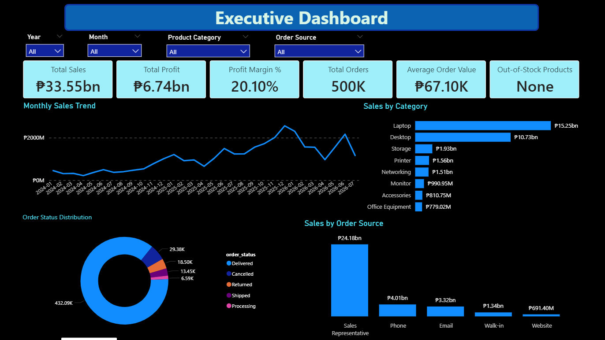
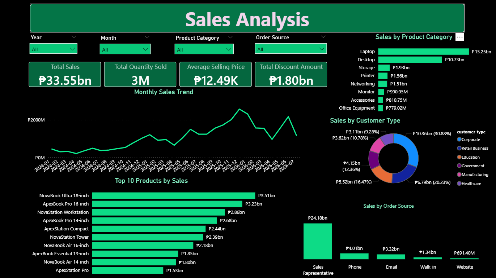
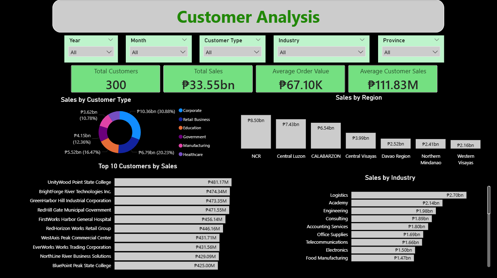
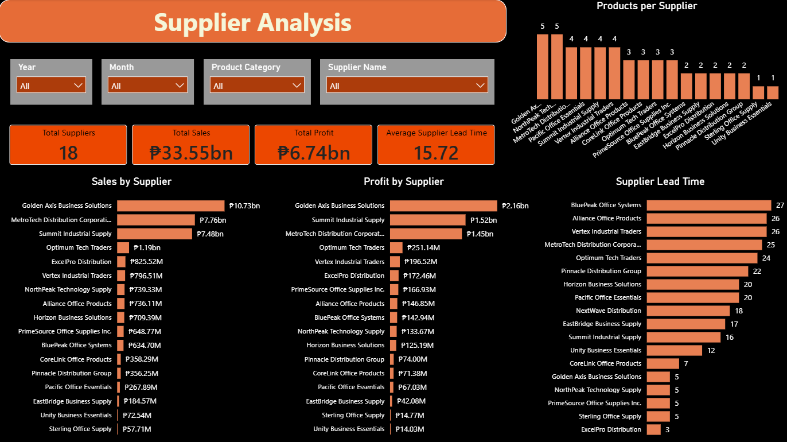
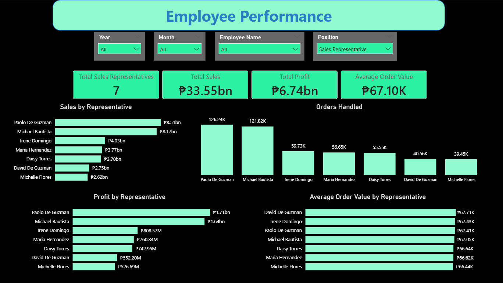
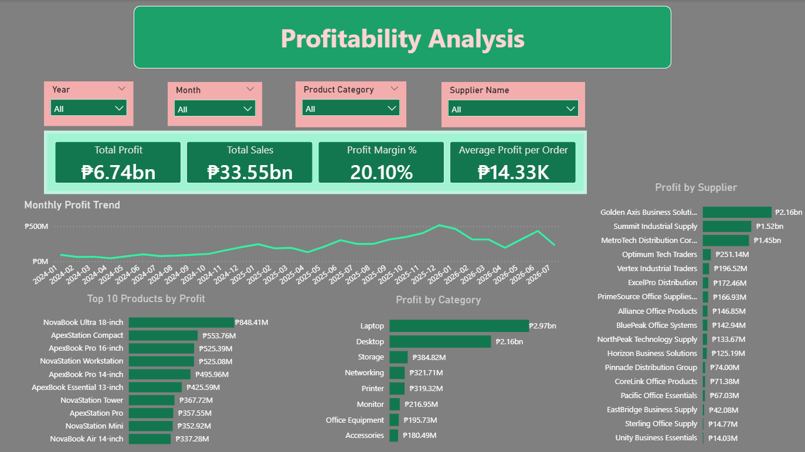

# Power BI Business Intelligence Report

## Overview

The Power BI phase transforms the cleaned and validated warehouse data
into an interactive business intelligence report for LOTS Corp., a
fictional warehouse distributor.

The report is designed to help decision-makers monitor sales,
profitability, customers, suppliers, employees, products, and inventory
through interactive dashboards.

The Power BI report contains **7 analytical pages**:

1.  Executive Dashboard
2.  Sales Analysis
3.  Products & Inventory Analysis
4.  Customer Analysis
5.  Supplier Analysis
6.  Employee Performance
7.  Profitability Analysis

------------------------------------------------------------------------

## Business Objective

The objective of the Power BI report is to turn the cleaned warehouse
transaction data into actionable business information.

The report allows users to:

-   Monitor overall sales and profitability.
-   Track sales trends over time.
-   Evaluate product and category performance.
-   Analyze customer segments and geographic markets.
-   Evaluate supplier sales, profitability, product coverage, and lead
    times.
-   Compare sales representative performance.
-   Monitor inventory availability.
-   Identify the products and suppliers contributing most to
    profitability.
-   Investigate business performance using interactive filters.

The report is intended to demonstrate the use of Power BI as an
analytical and reporting layer within an end-to-end data analysis
workflow.

------------------------------------------------------------------------

## Report Structure

### 1. Executive Dashboard

The Executive Dashboard provides a high-level view of overall business
performance.

**Key KPIs include:**

-   Total Sales
-   Total Profit
-   Profit Margin %
-   Total Orders
-   Average Order Value
-   Out-of-Stock Products

**Main analyses:**

-   Monthly Sales Trend
-   Sales by Category
-   Order Status Distribution
-   Sales by Order Source

This page is designed for quickly assessing the overall state of the
business before moving into more detailed analysis.



------------------------------------------------------------------------

### 2. Sales Analysis

The Sales Analysis page focuses on sales performance and sales
composition.

**Key KPIs include:**

-   Total Sales
-   Total Quantity Sold
-   Average Selling Price
-   Total Discount Amount

**Main analyses:**

-   Monthly Sales Trend
-   Sales by Product Category
-   Top 10 Products by Sales
-   Sales by Customer Type
-   Sales by Order Source

Interactive filters allow users to investigate sales performance by:

-   Year
-   Month
-   Product Category
-   Order Source



------------------------------------------------------------------------

### 3. Products & Inventory Analysis

The Products & Inventory Analysis page combines product performance with
current inventory information.

**Key KPIs include:**

-   Active Products
-   Total Quantity Sold
-   Out-of-Stock Products
-   Average Current Stock

**Main analyses:**

-   Inventory Status Distribution
-   Top 10 Products by Sales
-   Top 10 Products by Profit
-   Current Stock by Category
-   Lowest Available Stock

Interactive filters allow users to investigate product and inventory
performance by:

-   Year
-   Month
-   Product Category
-   Supplier

The page is particularly useful for identifying products with low
available stock while also understanding which products contribute most
to sales and profit.


------------------------------------------------------------------------

### 4. Customer Analysis

The Customer Analysis page examines sales performance across customer
segments and markets.

**Key KPIs include:**

-   Total Customers
-   Total Sales
-   Average Order Value
-   Average Customer Sales

**Main analyses:**

-   Sales by Customer Type
-   Sales by Region
-   Top 10 Customers by Sales
-   Sales by Industry

Interactive filters allow users to investigate customers by:

-   Year
-   Month
-   Customer Type
-   Industry
-   Province

This page helps identify important customer segments, high-value
customers, and geographic or industry-level sales patterns.



------------------------------------------------------------------------

### 5. Supplier Analysis

The Supplier Analysis page evaluates supplier contribution and
operational characteristics.

**Key KPIs include:**

-   Total Suppliers
-   Total Sales
-   Total Profit
-   Average Supplier Lead Time

**Main analyses:**

-   Products per Supplier
-   Sales by Supplier
-   Profit by Supplier
-   Supplier Lead Time

Interactive filters allow users to investigate supplier performance by:

-   Year
-   Month
-   Product Category
-   Supplier

This page provides a combined view of supplier commercial contribution
and lead-time characteristics.



------------------------------------------------------------------------

### 6. Employee Performance

The Employee Performance page evaluates the performance of sales
representatives.

**Key KPIs include:**

-   Total Sales Representatives
-   Total Sales
-   Total Profit
-   Average Order Value

**Main analyses:**

-   Sales by Representative
-   Orders Handled
-   Profit by Representative
-   Average Order Value by Representative

Interactive filters allow users to investigate employee performance by:

-   Year
-   Month
-   Employee Name
-   Position

The dashboard supports comparisons between sales representatives using
sales, profit, order volume, and average order value.



------------------------------------------------------------------------

### 7. Profitability Analysis

The Profitability Analysis page focuses specifically on the drivers of
profit.

**Key KPIs include:**

-   Total Profit
-   Total Sales
-   Profit Margin %
-   Average Profit per Order

**Main analyses:**

-   Monthly Profit Trend
-   Top 10 Products by Profit
-   Profit by Category
-   Profit by Supplier

Interactive filters allow users to investigate profitability by:

-   Year
-   Month
-   Product Category
-   Supplier

For profitability analysis, cancelled orders are excluded from the
sales/order denominator used for profitability-related calculations
because cancelled orders do not contribute to realized sales or profit.



------------------------------------------------------------------------

## Data Model

The Power BI report uses the cleaned warehouse datasets loaded into
PostgreSQL as its analytical data source.

The report model includes the core warehouse entities:

-   Orders
-   Order Details
-   Products
-   Customers
-   Suppliers
-   Employees
-   Inventory

A dedicated **Dim Date** table was also created for time-based analysis.

The date table is related to the order date in the Orders table and is
used for Year and Month filtering across the report.

The model uses relationships between transactional and master-data
tables so that users can analyze measures across products, customers,
suppliers, employees, and other business dimensions.

The database schema and detailed field definitions are documented
separately in the project documentation.

------------------------------------------------------------------------

## DAX Measures

The report uses DAX measures to calculate the main business metrics
rather than relying only on raw database columns.

The measure layer includes metrics for areas such as:

-   Sales
-   Profit
-   Costs
-   Orders
-   Quantity Sold
-   Customers
-   Products
-   Inventory
-   Profit Margin
-   Average Order Value
-   Average Selling Price
-   Discounts
-   Supplier performance

Measures are organized into logical display folders inside the Power BI
measure table to make the model easier to navigate and maintain.

The main measure table is named:

`Measure Table`

------------------------------------------------------------------------

## Interactive Features

The report uses interactive slicers and Power BI visual interactions to
allow users to investigate the data without modifying the underlying
dataset.

Depending on the dashboard, users can filter the report by dimensions
such as:

-   Year
-   Month
-   Product Category
-   Order Source
-   Supplier
-   Customer Type
-   Industry
-   Province
-   Employee
-   Position

The filtering behavior is intentionally based on the relationships and
analytical relevance of each dimension. Consequently, not every slicer
is expected to affect every visual on every page.

------------------------------------------------------------------------

## Analytical Capabilities Demonstrated

This Power BI implementation demonstrates practical Data Analyst skills
including:

### Data Modeling

-   Connecting Power BI to a PostgreSQL database.
-   Building relationships between business entities.
-   Creating and integrating a dedicated date dimension.
-   Organizing measures into display folders.

### Data Analysis

-   KPI development.
-   Time-series analysis.
-   Ranking and Top-N analysis.
-   Category analysis.
-   Customer segmentation.
-   Supplier performance analysis.
-   Employee performance comparison.
-   Inventory analysis.
-   Profitability analysis.

### Data Visualization

-   KPI cards.
-   Line charts.
-   Bar charts.
-   Donut charts.
-   Interactive slicers.
-   Comparative performance visuals.

### Business-Oriented Analysis

The report is structured around business questions rather than simply
displaying available columns. Each dashboard focuses on a specific
analytical area and provides metrics and visualizations relevant to that
area.

------------------------------------------------------------------------

## Business Insights

The dashboards provide a framework for investigating questions such as:

-   How are sales and profit changing over time?
-   Which product categories generate the most sales?
-   Which products contribute the most sales and profit?
-   Which customer types and industries generate the most revenue?
-   Which customers are the highest-value customers?
-   Which suppliers contribute the most sales and profit?
-   Which suppliers have longer lead times?
-   Which sales representatives generate the most sales and profit?
-   Which products have the lowest available stock?
-   Which categories contribute most to overall profitability?

The report is designed to let the user answer these questions
interactively instead of relying on static summaries.

------------------------------------------------------------------------

## Data Quality and Validation

The Power BI report was built after the datasets had already gone
through data cleaning and validation.

The overall project workflow was:

``` text
Synthetic Data Generation
        ↓
Raw CSV Data
        ↓
Excel Power Query Cleaning
        ↓
Cleaned CSV Data
        ↓
Data Validation
        ↓
PostgreSQL Database
        ↓
SQL Analysis
        ↓
Power BI Data Model
        ↓
DAX Measures
        ↓
Interactive Dashboards
```

Data cleaning, validation, database design, SQL analysis, and the data
dictionary are documented in the other project documentation.

------------------------------------------------------------------------

## Known Limitation

During the PostgreSQL import process, financial check constraints for
`line_total`, `line_cost`, and `line_profit` were removed after an
investigation into a rounding discrepancy between the generated CSV
values and PostgreSQL's calculated values.

The issue was documented rather than silently ignored.

The current portfolio prioritizes demonstrating the complete analytical
workflow and business intelligence capabilities. The financial
calculation/rounding issue remains a candidate for future refinement of
the synthetic data generation and validation process.

------------------------------------------------------------------------

## Future Improvements

Potential future improvements include:

-   Revisiting the financial rounding logic in the dataset generator.
-   Strengthening financial validation between Python, PostgreSQL, and
    Power BI.
-   Adding additional operational KPIs.
-   Adding drill-through pages for detailed investigation.
-   Improving report-wide visual consistency.
-   Adding more advanced time-intelligence measures.
-   Publishing the report through an appropriate Power BI deployment
    environment if required.

------------------------------------------------------------------------

## Conclusion

The Power BI report completes the business intelligence layer of the
LOTS Corp. warehouse analytics project.

It demonstrates an end-to-end workflow in which raw transactional data
is cleaned, validated, stored in a relational database, analyzed with
SQL, modeled in Power BI, transformed into DAX measures, and presented
through interactive business dashboards.

The result is a portfolio project focused on practical Data Analyst
responsibilities rather than isolated technical exercises.
